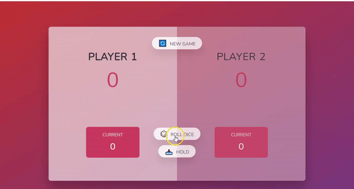

## ROLL THE DICE

This is a 2-player based dice game with a nice user interface

### Preview



### Game rules

- The first player to get to **100** total points wins the game
- If you **roll** a 1, you lose your current score accumulated and the turn shift to the next player
- If you click the **hold** button,your current score is added to the total score and your current score is reseted to 0 and the next player plays until he holds or roll a 1.

### How to play

- visit this link to play: [roll](https://roll-the-dice-omega.vercel.app/)

- click the **roll** button to roll the dice

- click the **hold** button to add yur current score to the total score

- click the **New game** button to start a new game

```js
const tryIt = () => {
  console.log('Another DOM manipulation inclined project yay!🎉');
};
```

#### Author

- LinkedIn - [Let's connect](http://www.linkedin.com/in/yaya-usman-adaiza-430964192)
- Frontend Mentor - [@Elixir-K](https://www.frontendmentor.io/profile/Elixir-K)
- Twitter - [@ylincoln222](https://twitter.com/ylincoln222)
- Website - [check back in few months time :)]()

#### Acknowledgement

Credit to my JS tutor: [Jonas Schmedtmann](https://twitter.com/jonasschmedtman)
